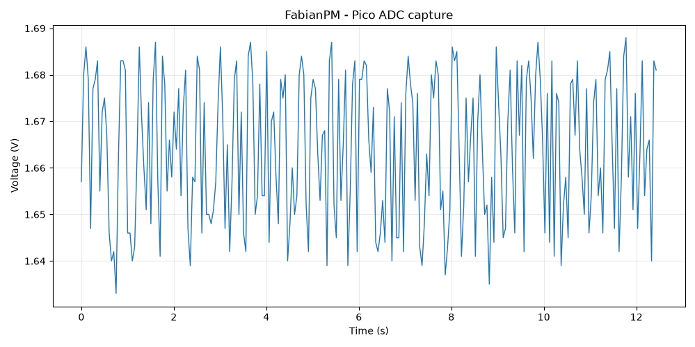

## First ADC capture

The first saved ADC capture used a two-resistor divider to generate approximately 1.65 V at GPIO26.

The Pico sampled the ADC at a target rate of 20 Hz and streamed timestamped measurements over USB serial.

The first capture contained:

```text
249 samples
12.429 s duration
19.95 Hz measured average sample rate
1.6638 V mean measured voltage
```



The analysis script used to generate the plot is in:

```text
analysis/plot_adc_capture.py
```

The source data is in:

```text
data/adc_capture.csv
```
