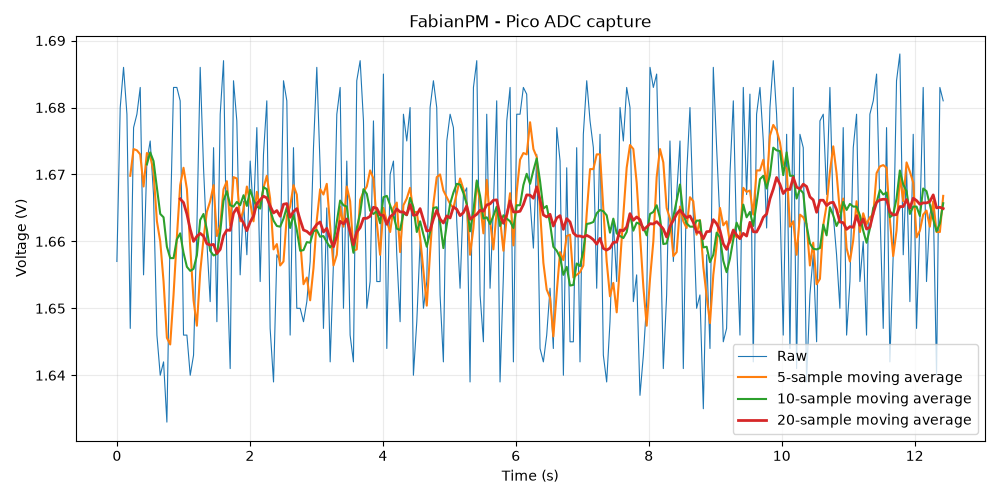

# Experiment 003 - ADC Basics

## Objective

Read an analog voltage using the Raspberry Pi Pico W ADC, convert the raw ADC result into volts, and stream timestamped measurements over USB serial.

## Hardware

- Raspberry Pi Pico W
- Breadboard
- Two equal-value resistors
- Jumper wires
- USB connection to Arch Linux host

ADC input:

```text
GPIO26 / ADC0
```

## ADC range

The RP2040 ADC produces a 12-bit result:

```text
0-4095
```

The firmware converts the raw count to an approximate voltage using:

```c
const float conversion_factor = 3.3f / 4095.0f;
float voltage = raw * conversion_factor;
```

## Initial tests

### Ground

Connecting GPIO26 to ground produced readings near:

```text
0-30 counts
```

### 3.3 V

Connecting GPIO26 to 3V3 produced readings near:

```text
4095 counts
```

### Half-scale divider

Two equal resistors were used as a voltage divider:

```text
3V3 -- R --+-- R -- GND
           |
         GPIO26
```

The expected midpoint voltage is:

```text
3.3 V / 2 = 1.65 V
```

Observed readings were around:

```text
2040-2090 counts
```

with values close to:

```text
2050 counts
1.651 V
```

## Wiring mistake

The first divider attempt was wired incorrectly.

Instead of staying near half-scale, the ADC value gradually decayed toward zero.

After rewiring GPIO26 to the actual junction between the two resistors, the reading stabilized near 1.65 V.

That made the difference between a defined analog node and a floating or poorly connected node very obvious.

## Time-series capture

The firmware was changed to output:

```text
time_ms,raw_adc,voltage
```

with:

```c
sleep_ms(50);
```

giving a target sample rate of 20 Hz.

The first saved dataset contained:

```text
249 samples
12.429 s duration
50.117 ms average sample interval
19.95 Hz average sample rate
```

Measured ADC statistics:

```text
mean:        2064.61 counts
std dev:       19.16 counts
minimum:     2027 counts
maximum:     2095 counts
```

Measured voltage statistics:

```text
mean:        1.6638 V
std dev:     0.0155 V
minimum:     1.633 V
maximum:     1.688 V
```

## Moving-average comparison

The saved dataset was also used to test simple moving-average filtering.

Three window sizes were compared against the raw signal:

```text
5 samples
10 samples
20 samples
```

At the measured sampling rate of 19.95 Hz, the approximate averaging periods were:

```text
5 samples  ≈ 0.25 s
10 samples ≈ 0.50 s
20 samples ≈ 1.00 s
```

The raw voltage standard deviation was:

```text
0.0155 V
```

After filtwering:

```text
5-sample moving average:   0.0065 V
10-sample moving average:  0.0038 V
20-sample moving average:  0.0023 V
```

Relative to the raw signal, the standard deviation was reduced by approximately:

```text
5-sample:   58%
10-sample:  75%
20-sample:  85%
```

The larger windows produced progressively smoother traces.



This capture used a nearly constant input, so it does not yet show the main tradeoff of moving-average filtering: larger windows reduce noise but respond more slowly to real changes in the signal.

The next experiment will use a variable analog input to make that lag measurable.
