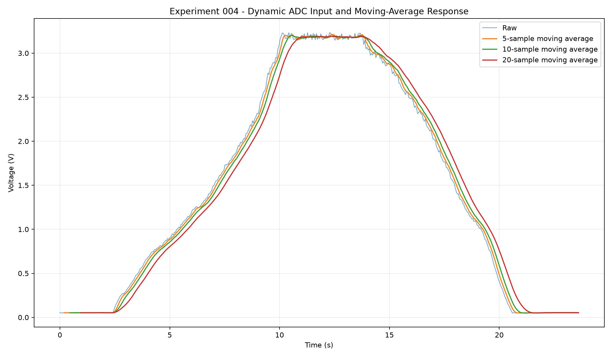

# Experiment 004 - Dynamic ADC Input

## Objective

Use a 10k ohm linear potentiometer to generate a controllable analog input and measure how different moving-average filters respond to a changing signal.

## Hardware

- Raspberry Pi Pico W
- 10k ohm linear potentiometer
- Breadboard
- Jumper wires
- Multimeter

## Plan

- connect the potentiometer between 3V3 and GND
- connect the wiper to GPIO26/ADC0
- verify wiper voltage with the multimeter
- sweep the input through the ADC range
- capture timestamped data
- compare raw, 5-sample, 10-sample, and 20-sample moving averages
- measure visible filtering lag

## Results

The potentiometer was swept through most of the Pico W ADC input range while
the firmware sampled GPIO26/ADC0 approximately every 50 ms.

The capture contained 472 samples over 23.603 seconds.

### Acquisition timing

- Mean sample interval: 50.113 ms
- Minimum sample interval: 50 ms
- Maximum sample interval: 51 ms
- Effective sample rate: 19.955 Hz

### Measured range

- Minimum ADC reading: 60
- Maximum ADC reading: 4013
- Minimum calculated voltage: 0.048 V
- Maximum calculated voltage: 3.234 V

### Moving-average response

The recorded voltage was processed using trailing moving averages with
windows of 5, 10, and 20 samples.

At the measured sample rate, the approximate effective delays were:

- 5 samples: 100.2 ms
- 10 samples: 225.5 ms
- 20 samples: 476.1 ms

Larger windows produced smoother output but responded slower to changes
in potentiometer position. This demonstrates the tradeoff between noise
reduction and responsiveness that will matter later when filtering
strain-derived torque measurements.

### Endpoint observations

Samples below 0.1 V had a mean of 0.052 V with a standard deviation of
0.0040 V.

Samples above 3.1 V had a mean of 3.186 V with a standard deviation of
0.0265 V.

These endpoint statistics are useful as an initial indication of measurement
variation, but they should not be treated as a controlled ADC noise
measurement because the potentiometer was moved by hand during the same
capture.
